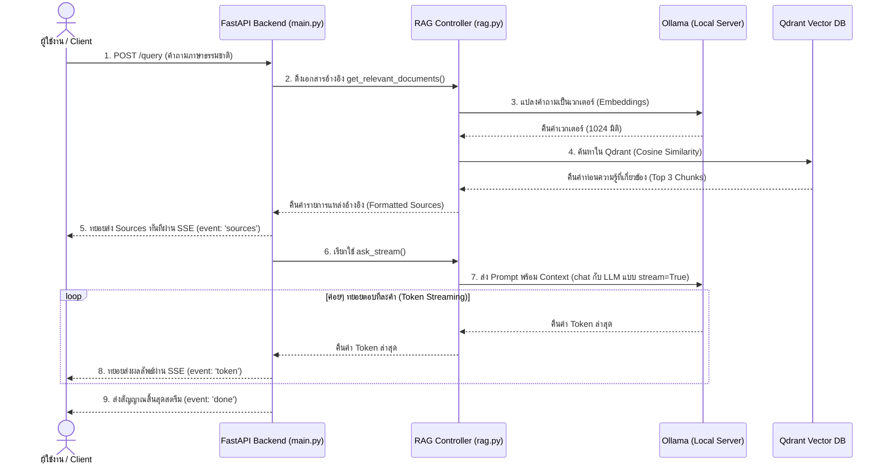

# 🚀 Local RAG Web API (FastAPI + Qdrant + Ollama)

โปรเจกต์นี้คือตัวต้นแบบระบบ **RAG (Retrieval-Augmented Generation)** สำหรับรันแบบ On-Premise/Local ในเครื่องผู้ใช้ โดยมีโครงสร้างแบบแยกส่วนบริการ (Modular API Backend) ด้วย **FastAPI** และจัดเก็บเวกเตอร์ใน **Qdrant Vector Database** พร้อมประมวลผลคำถามคำตอบผ่าน **Ollama (Local LLM & Embedding)** ตามแบบอย่างแนวทางในบทความของ PALO IT

---

## 🛠️ สถาปัตยกรรมและโครงสร้างไฟล์

```
.
├── docker-compose.yml       # จัดเตรียมฐานข้อมูล Qdrant
├── constants.py             # ค่าคอนฟิกูเรชันหลัก (DB, Models)
├── rag.py                   # โมดูลควบคุมตรรกะหลักของ RAG (ใช้ qdrant-client)
├── main.py                  # API Backend (FastAPI Web Server)
├── ask.py                   # สคริปต์ CLI สำหรับใช้ทดสอบยิงคำถาม
└── README.md                # คู่มือการใช้งานนี้
```

---

## 📡 ทำไมถึงใช้ Qdrant?

**Qdrant** เป็นระบบจัดการฐานข้อมูลเวกเตอร์ (Vector Database) ประสิทธิภาพสูงที่พัฒนาด้วยภาษา **Rust** มีความเร็วและแม่นยำในการค้นหาความคล้ายคลึงของเวกเตอร์ (Vector Similarity Search) ด้วยโครงสร้างดัชนีแบบ HNSW และมีความสามารถพิเศษหลายอย่าง เช่น:
1. **ออกแบบมาเฉพาะทาง:** มีการจัดการและจูนหน่วยความจำสำหรับเวกเตอร์ความละเอียดสูงได้อย่างดีเยี่ยม
2. **Payload-based Filtering:** สามารถแนบข้อมูลประกอบ (เช่น category, metadata) ไปกับเวกเตอร์และทำ Filter ได้อย่างรวดเร็ว
3. **Dashboard ในตัว:** มี Web UI Console ให้เราเข้าไปตรวจสอบโครงสร้าง Collection และข้อมูล Point ต่าง ๆ ได้ทันที

---

## 🚀 ขั้นตอนการติดตั้งและเริ่มใช้งาน

### 1. สตาร์ท Qdrant Database
สั่งรันตู้คอนเทนเนอร์ของ Qdrant ผ่าน Docker Compose:
```bash
docker compose up -d
```
หลังจากรันสำเร็จ คุณสามารถเปิดเข้าไปดูหน้า Console Dashboard ของ Qdrant ได้ที่: http://localhost:6333/dashboard

### 2. ดาวน์โหลดโมเดลบน Ollama
กรุณาเปิดบริการโปรแกรม [Ollama](https://ollama.com) และสั่งดาวน์โหลดโมเดลใน Terminal:
```bash
# โมเดลสำหรับสร้างเวกเตอร์แปลงคำพูด (Embedding)
ollama pull bge-m3

# โมเดลสำหรับวิเคราะห์และสร้างคำตอบ (Local LLM)
ollama pull qwen3:8b
```

### 3. ติดตั้ง Dependencies และเปิดเซิร์ฟเวอร์
สร้าง Virtual Environment และรันเซิร์ฟเวอร์ FastAPI:
```bash
# สร้างและเปิดใช้งาน venv
python3 -m venv .venv
source .venv/bin/activate

# ติดตั้งไลบรารี
pip install qdrant-client ollama fastapi uvicorn pydantic httpx pypdf

# เริ่มการทำงานของ Backend API
uvicorn main:app --reload
```
ตัว API จะสแตนด์บายรับคำสั่งที่: http://127.0.0.1:8000

---

## 📡 ตัวอย่างการเรียกใช้งาน API (Endpoints)

### 📥 1. การนำข้อมูลเข้า (POST `/ingest`)
แปลงเนื้อหาที่ต้องการเป็นเวกเตอร์และนำไปจัดเก็บใน Qdrant:

* **URL:** `http://127.0.0.1:8000/ingest`
* **BODY (JSON):**
```json
{
  "content": "แมวเป็นของเหลวเนื่องจากสามารถปรับรูปทรงตามภาชนะที่มันเข้าไปอยู่ได้ตามผลการวิจัย Ig Nobel",
  "category": "science"
}
```
* **คำสั่งยิงผ่าน cURL:**
```bash
curl -X POST http://127.0.0.1:8000/ingest \
  -H "Content-Type: application/json" \
  -d '{"content": "แมวเป็นของเหลวเนื่องจากสามารถปรับรูปทรงตามภาชนะที่มันเข้าไปอยู่ได้ตามผลการวิจัย Ig Nobel", "category": "science"}'
```

---

### 💬 2. ถามคำถามกับ RAG (POST `/query`)
สืบค้นหาบริบทจาก Qdrant และรวบรวมส่งให้ Ollama LLM สร้างคำตอบสรุป:

* **URL:** `http://127.0.0.1:8000/query`
* **BODY (JSON):**
```json
{
  "query": "ทำไมแมวถึงเป็นของเหลว?"
}
```
* **คำสั่งยิงผ่าน cURL:**
```bash
curl -X POST http://127.0.0.1:8000/query \
  -H "Content-Type: application/json" \
  -d '{"query": "ทำไมแมวถึงเป็นของเหลว?"}'
```

---

### 💻 3. ทดสอบอย่างง่ายผ่าน CLI
คุณสามารถทดสอบถามคำถามระบบ RAG ได้ทันทีผ่าน Terminal โดยสั่งรัน:
```bash
python ask.py "ทำไมแมวถึงเป็นของเหลว"
```

---

## 📡 สรุป Flow การทำงาน (User Query to Response)

ลำดับการทำงานตั้งแต่ผู้ใช้ส่งคำถามไปจนถึงหน้าบ้านได้รับคำตอบ:


